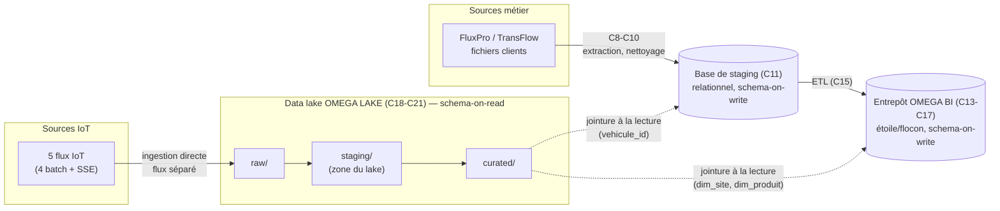
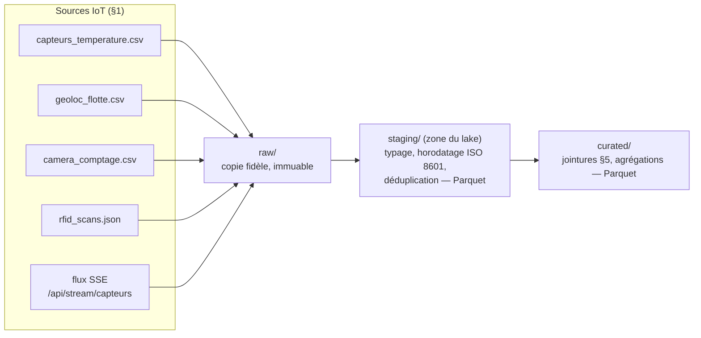

# Architecture du data lake OMEGA LAKE

**Compétence couverte : C18 — Concevoir une architecture de données pour le big data**
**Épreuve associée : E7**

Ce document conçoit l'architecture du data lake OMEGA LAKE : organisation
en zones, choix de format par flux, et articulation avec la base de
staging (C11) et l'entrepôt OMEGA BI (C13-C17) déjà en place — point
explicitement laissé ouvert par le compte rendu de M2
([§5](../comptes_rendus/M2.md#5-points-ouverts--risques-pour-la-suite-m3--data-lake-omega-lake)).
Sur le même principe que C13 pour le Bloc 3 : ce livrable est une
conception, l'implémentation concrète des composants suit en C19.

---

## 1. Les 5 flux à absorber

Déjà réels dans le dépôt, volumétrie vérifiée directement (voir
[sequencement_bloc4.md §1](sequencement_bloc4.md#1-point-de-départ--les-données-iot-sont-déjà-présentes-et-réelles)) :

| Flux | Mode | Format source | Contenu |
|---|---|---|---|
| `capteurs_temperature.csv` | Batch | CSV | Température par entrepôt/zone, alerte |
| `geoloc_flotte.csv` | Batch | CSV | Position GPS par véhicule |
| `camera_comptage.csv` | Batch | CSV | Comptage de passages par entrepôt/zone |
| `rfid_scans.json` | Batch | JSON (liste) | Scans palette par entrepôt/zone/SKU |
| `/api/stream/capteurs` | Streaming | SSE (JSON par évènement) | Température + géoloc, 1 évt/2s, non borné |

Ces 5 flux illustrent les 3V du big data (volumétrie, variété, vitesse)
qui justifient un data lake plutôt qu'une extension de la base de
staging relationnelle — raisonnement déjà posé en C2
([topographie des données §3.5](topographie_donnees.md#35-données-iot-anticipation-du-bloc-4--data-lake-omega-lake)),
confirmé ici après avoir effectivement regardé le contenu des fichiers.

---

## 2. Trois couches de stockage, trois logiques différentes

Le programme empile trois briques de stockage — base de staging (C11),
entrepôt OMEGA BI (C13-C17), data lake OMEGA LAKE (C18-C21) — mais ce
n'est **pas** un simple empilement de couches de plus en plus « propres »
au fil du nettoyage. Chacune répond à une logique de modélisation
différente, pas seulement à un degré de nettoyage différent :



| | Base de staging (C11) | Entrepôt OMEGA BI (C13-C17) | Data lake OMEGA LAKE (C18-C21) |
|---|---|---|---|
| **Modélise** | Des entités métier opérationnelles (un client, une commande, une tournée) | Des faits analytiques décisionnels (une expédition livrée, un stock à une date) | Des évènements bruts, sans modélisation métier a priori |
| **Structure** | Relationnelle normalisée (3NF, MERISE) | Étoile/flocon, dénormalisée volontairement (dimensions conformées, tables de faits) | Fichiers, tout format (CSV/JSON/Parquet) |
| **Schéma** | Schema-on-write : structure SQL fixée avant toute écriture | Schema-on-write : tables typées, connues à l'avance | Schema-on-read : la structure s'applique à la lecture, pas à l'écriture |
| **Répond à** | « Quel est l'état actuel de l'activité ? » (une commande, une tournée) | « Quel indicateur, sur quelle période ? » (taux de service, délai moyen) — questions déjà anticipées en C13 | « Quelles données a-t-on, avant même de savoir toutes les analyses qu'on en fera ? » |
| **Pourquoi ce n'est pas redondant** | Reflet fidèle des systèmes sources après nettoyage — seule source de vérité opérationnelle | Reconstruit entièrement depuis la staging à chaque exécution (C15) — jetable/rechargeable, pas une copie figée | Absorbe ce qu'aucune des deux bases relationnelles ne peut ingérer (volumétrie, variété, vitesse — §1) |

**Ce qui différencie vraiment l'entrepôt du data lake** — la question la
plus fréquente sur ce sujet, y compris hors contexte pédagogique — n'est
ni le volume ni le degré de nettoyage : c'est **le moment où le schéma
est décidé**. Un entrepôt répond à des questions métier déjà identifiées
au moment de sa conception (C13 : « quel taux de service par client ? »
est tranché avant même de créer `Fait_Expedition`) — toute question
vraiment nouvelle suppose une évolution de schéma. Un data lake accueille
la donnée brute sans décider à l'avance de toutes les analyses futures :
`rfid_scans.json` est stocké tel quel en `raw/` sans savoir encore quelles
analyses en seront tirées — la structure n'est imposée qu'à la lecture
(`curated/`), et peut évoluer sans réécrire ce qui a déjà été stocké.

---

## 3. Organisation en zones

Reprend le principe à 3 zones déjà arrêté en C3
([architecture cible §2.2](architecture_cible.md#22-vue-en-couches)/[§2.3](architecture_cible.md#23-choix-technologiques-proposés)) :
stockage objet compatible S3 (MinIO en local), zones `raw`/`staging`/`curated`.

**Attention de nommage, à ne pas confondre** : la zone `staging` du lake
(zone intermédiaire, à l'intérieur d'OMEGA LAKE) n'a **aucun rapport**
avec « la base de staging » (C11, PostgreSQL, `datacore_staging`) qui
alimente l'entrepôt OMEGA BI. Les deux portent le même mot par pur
héritage du vocabulaire Kimball/data lake standard — deux briques de
stockage physiquement et technologiquement distinctes. Pour lever toute
ambiguïté dans ce document et dans le code, la zone du lake est toujours
désignée **zone staging du lake** ci-dessous, jamais « la base de
staging » seule.

| Zone | Rôle | Transformation appliquée | Immuabilité |
|---|---|---|---|
| `raw/` | Dépôt brut, fidèle à la source | Aucune — copie telle quelle | Oui, jamais réécrite ni supprimée |
| `staging/` (zone du lake) | Nettoyage minimal | Typage, horodatage uniforme (ISO 8601), déduplication basique | Non — peut être régénérée depuis `raw/` |
| `curated/` | Données prêtes à la consommation | Enrichissement par jointure aux clés naturelles (§5), agrégations utiles | Non — régénérable depuis `staging/` |

Ce qui se passe concrètement entre les 3 zones, pour les 5 flux :



**Analogie avec l'« architecture médaillon » (bronze / silver / gold)** :
les zones `raw`/`staging`/`curated` retenues ici correspondent à ce que
l'industrie appelle couramment l'architecture médaillon — popularisée par
Databricks, et reprise comme motif recommandé dans les lakehouses
Microsoft Fabric/OneLake (`bronze` ≈ `raw`, `silver` ≈ `staging` du lake,
`gold` ≈ `curated`). Le vocabulaire diffère selon l'outil, le principe de
zonage progressif est le même. Ce programme retient MinIO plutôt que
Fabric pour des raisons déjà actées en C3 (fonctionnement local, coût,
indépendance vis-à-vis d'un fournisseur cloud propriétaire — voir
[architecture cible §2.5](architecture_cible.md#25-alternative-écartée--microsoft-fabric)),
mais le principe de zonage progressif est transférable d'un outil à
l'autre.

Convention de chemin (bucket unique `omega-lake`, préfixes par zone) :

```
omega-lake/raw/<flux>/date=<AAAA-MM-JJ>/<fichier_source>
omega-lake/staging/<flux>/date=<AAAA-MM-JJ>/part-*.parquet
omega-lake/curated/<flux>/date=<AAAA-MM-JJ>/part-*.parquet
```

Partitionnement par date dans les 3 zones : cohérent avec la fréquence
quotidienne des 4 flux batch, et permet de fenêtrer le flux SSE (non
borné) en fichiers journaliers exploitables plutôt qu'un flux continu
non partitionné.

**Formats retenus** : `raw/` conserve le format natif de la source (CSV,
JSON, ou JSON ligne-à-ligne pour le SSE reconstitué en fichiers
journaliers) — aucune perte d'information à la source. `staging/` et
`curated/` utilisent Parquet (colonne, compressé, typé) — format ouvert,
cohérent avec le choix « pas d'outil sous licence propriétaire »
([architecture cible §2.3](architecture_cible.md#23-choix-technologiques-proposés)),
lisible par tout outil Python (`pandas`/`pyarrow`) sans moteur big data
dédié, proportionné au volume réel du programme (quelques milliers de
lignes/jour, pas un cas Spark/Hadoop).

---

## 4. Ingestion : flux séparé de la base de staging relationnelle

**Décision** : les 5 flux IoT sont ingérés **directement depuis leur
source vers `omega-lake/raw/`**, sans jamais transiter par la base de
staging PostgreSQL (C11). Flux séparé, pas d'alimentation croisée en
entrée.

**Justification** :
- La base de staging (C11) est un schéma relationnel normalisé conçu
  pour les entités métier FluxPro/TransFlow/clients (`modelisation_merise.md`)
  — commandes, expéditions, tournées. Les flux IoT n'ont pas cette
  structure : séries temporelles à haute fréquence (1 évènement/2s en
  continu pour le SSE), pas d'entité métier normalisable au sens MERISE.
- Le SSE en particulier (non borné, 1 évènement/2s) n'a pas vocation à
  transiter par une transaction PostgreSQL ligne à ligne — c'est
  exactement le cas d'usage qui justifie un data lake plutôt qu'une
  extension de la base relationnelle (§1).
- Aucune des 3V (volumétrie, variété, vitesse) qui justifient le choix
  du data lake en C2/C3 ne serait résolue en faisant transiter ces flux
  par la base de staging — ce serait recréer le problème que le data
  lake existe pour éviter.

Ce choix ne remet pas en cause le principe de sobriété du programme
(une base de staging unique en entrée, [architecture cible
§2.1](architecture_cible.md#21-principes-directeurs)) : ce principe visait
les sources métier transactionnelles (C8), pas les flux IoT, hors
périmètre du Bloc 2 dès la topographie des données (C2).

---

## 5. Curated : conçue pour être jointe à l'existant, pas fusionnée avec lui

Si l'ingestion est séparée (§4), la zone `curated/` est en revanche
**conçue pour être jointe** aux données déjà en place — via de vraies
clés naturelles, vérifiées dans les données réelles, pas supposées :

| Flux IoT | Clé naturelle | Se joint à | Vérifié |
|---|---|---|---|
| `capteurs_temperature`, `camera_comptage`, `rfid_scans` | `entrepot` (ex. `OMG-LYO`) | `dimensions.dim_site.code` (entrepôt) | Valeurs identiques dans les 3 fichiers IoT et `entrepots.csv`/`dim_site` |
| `rfid_scans` | `produit_sku` | `dimensions.dim_produit.sku` | SKUs des scans RFID présents dans `produits.csv` (ex. `SKU-10002`) |
| `geoloc_flotte`, flux SSE | `vehicule_id` (ex. `VH-004`) | `tournees.vehicule_id` (base de staging) | Même format `VH-0NN` (15 véhicules), fenêtres temporelles qui se recouvrent réellement (`geoloc_flotte` : 01-03/08/2026 ; `tournees` : jusqu'au 04/08/2026) |

**Jointure à la lecture, pas de duplication physique** : ces
rapprochements se font par requête (le curated Parquet est interrogeable
directement, ou via une vue applicative croisant lake et entrepôt), pas
en copiant les données de l'entrepôt/de la base de staging dans le lake
ni l'inverse — cohérent avec le principe de sobriété (§4) et avec le
choix déjà fait en C13 de ne pas dupliquer inutilement (dimensions
conformées, pas de copies).

**Cas d'usage métier concret qui justifie ce choix** (pas seulement
technique) : **FreshMarket** est le seul client à porter des produits
à température dirigée (10/30 produits, tous `client_id=2` — vérifié,
cohérent avec la découverte C13 « un client = une seule catégorie »).
Le suivi de la chaîne du froid de FreshMarket (exigence explicite de
l'étude de faisabilité, [§1](etude_faisabilite.md#1-contexte)) est donc
l'usage métier direct de `capteurs_temperature` (zones froides) croisé
avec `dim_produit.temperature_dirigee`/`dim_client` de l'entrepôt — un
exemple réel, pas hypothétique, de ce que la zone curated doit permettre
sans nécessiter de fusionner les deux briques de stockage.

---

## 6. Point de vigilance RGPD identifié en concevant cette architecture

**Constat nouveau, trouvé en vérifiant le recouvrement temporel des
données** (pas une simple reprise du point déjà signalé en CoSu du
21/09 sur la géolocalisation) : la clé `vehicule_id` permet de joindre
une trace de géolocalisation du lake (`geoloc_flotte`/flux SSE) à
`tournees.vehicule_id` dans la base de staging, et `tournees.chauffeur`
(donnée personnelle déjà répertoriée,
[registre RGPD §1](registre_rgpd.md)) est sur la même ligne. Le
recouvrement n'est pas seulement possible en théorie : les fenêtres
temporelles se recouvrent réellement (§5) — une trace de géolocalisation
du 2 août 2026 pour `VH-004` est donc, en pratique, ré-identifiable
jusqu'au chauffeur via une jointure manuelle avec `tournees`.

**Décision de conception actée ici** : `vehicule_id` reste stocké tel
quel dans le lake (nécessaire à l'usage métier — suivi de flotte), mais
**aucune jointure automatisée `vehicule_id` → `chauffeur` n'est
implémentée** dans le pipeline curated — la zone curated ne matérialise
jamais `chauffeur` aux côtés d'une trace de géolocalisation. La
possibilité de ré-identification manuelle reste réelle et doit être
traitée comme un traitement à part entière dans le registre RGPD de
C21 (pas seulement `geoloc_flotte` isolément) — signalé explicitement
ici pour que C21 ne le découvre pas tardivement.

---

## 7. Ce qui reste à faire en C19

Ce document arrête la conception ; **rien n'est encore installé**. C19
couvre : déploiement de MinIO (service Docker Compose), création du
bucket `omega-lake` et de ses préfixes, script d'ingestion batch des 4
fichiers CSV/JSON vers `raw/`, consommateur du flux SSE vers `raw/`
(fenêtré par jour), et les transformations `raw/` → `staging/` →
`curated/` (typage, Parquet, jointures définies en §5).

---

## 8. Références

- [`architecture_cible.md`](architecture_cible.md) §2.2/§2.3/§2.5 — choix
  de principe (zones, MinIO) déjà actés en C3.
- [`topographie_donnees.md`](topographie_donnees.md) §3.5 — inventaire
  initial des 5 flux IoT.
- [`sequencement_bloc4.md`](sequencement_bloc4.md) — ordre C18→C21 et
  volumétrie réelle vérifiée.
- [`registre_rgpd.md`](registre_rgpd.md) — traitement existant sur
  `tournees.chauffeur`, complété par le constat du §6 ci-dessus.
- [`modelisation_omega_bi.md`](modelisation_omega_bi.md) §6 — dimensions
  conformées de l'entrepôt (`dim_site`, `dim_produit`) utilisées comme
  cibles de jointure en §5.
