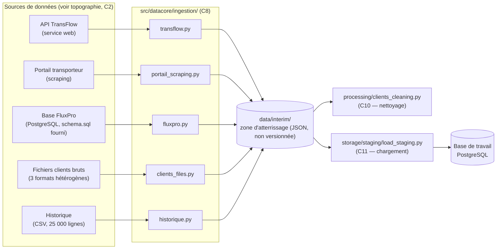
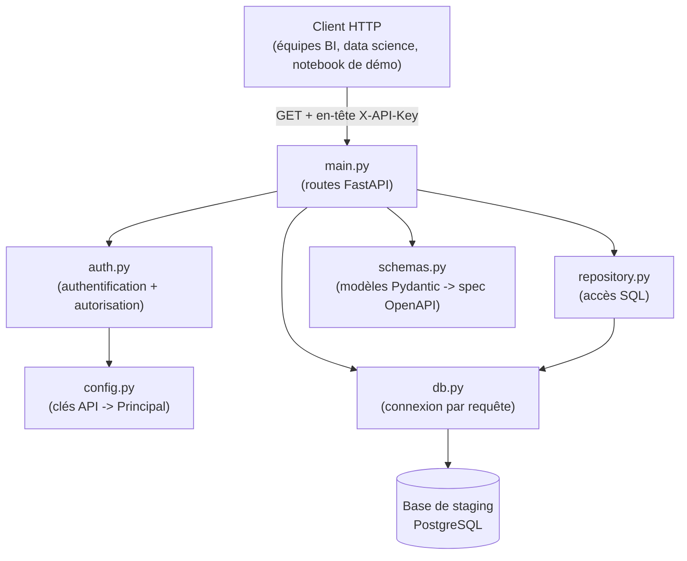
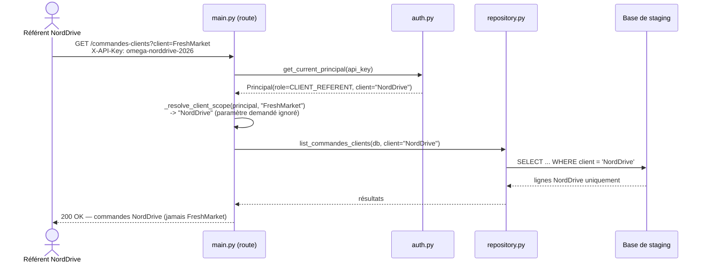

# Diagrammes techniques — Ingestion (C8) et Omega Data API (C12)

Diagrammes Mermaid illustrant l'architecture réelle des deux modules les
plus structurants du Bloc 2 : la collecte multi-source (C8) et l'API
d'exposition (C12). Objectif double : documentation immédiate (rendue
nativement par GitHub) et matière prête à intégrer au futur rapport
technique LaTeX (M4, transverse) — voir §4 pour l'export en image.

---

## 1. Architecture de l'ingestion (C8)

Les cinq connecteurs (`src/datacore/ingestion/`) sont indépendants les
uns des autres et convergent tous vers la même zone d'atterrissage
intermédiaire (`data/interim/`, voir
[`sequencement_bloc2.md`](sequencement_bloc2.md)), avant que C10
(nettoyage) et C11 (chargement en base) ne les consomment.

**Points clés reflétés dans le diagramme** : chaque connecteur ne fait
qu'extraire et écrire dans la zone d'atterrissage (aucune logique de
nettoyage ni de modélisation à ce stade — voir la justification du
séquencement C8 → C10 → C9 → C11 → C12) ; `fluxpro.py` lit directement
la base déjà peuplée (issue #7), les quatre autres connecteurs
interrogent des sources externes (API, HTML, fichiers).

---

## 2. Architecture de l'Omega Data API (C12)

### 2.1 Organisation des modules

### 2.2 Séquence d'autorisation — le comportement critique

Le comportement le plus important de l'API n'est pas visible dans le
diagramme de modules ci-dessus : un référent client n'est pas seulement
*rejeté* s'il demande les données d'un autre client, il est
*silencieusement ramené* à son propre périmètre. Ce diagramme de
séquence illustre ce cas réel (vérifié en conditions réelles, voir
[`api_omega_data.md` §5](api_omega_data.md#5-exemples-réels) et
[`notebooks/demo_omega_data_api.ipynb`](../../notebooks/demo_omega_data_api.ipynb)).

---

## 3. Sources de ces diagrammes

Ces diagrammes décrivent le code réellement livré (pas une intention) :
`src/datacore/ingestion/` (C8, PR #33), `src/datacore/api/` (C12, PR #41).
Toute évolution de ces modules doit s'accompagner d'une mise à jour de
ce document.

## 4. Export pour le rapport LaTeX (M4, transverse)

Mermaid n'est pas nativement supporté par LaTeX. Au moment de rédiger le
rapport technique (milestone M4, prévu plus tard), ces diagrammes
devront être exportés en image (SVG/PDF) — par exemple via
[`mermaid-cli`](https://github.com/mermaid-js/mermaid-cli)
(`mmdc -i diagrammes_techniques.md -o diagramme.svg`) — puis inclus avec
`\includegraphics`. Non fait à ce stade : action reportée à M4, cette
page reste la source de vérité éditable en attendant.
