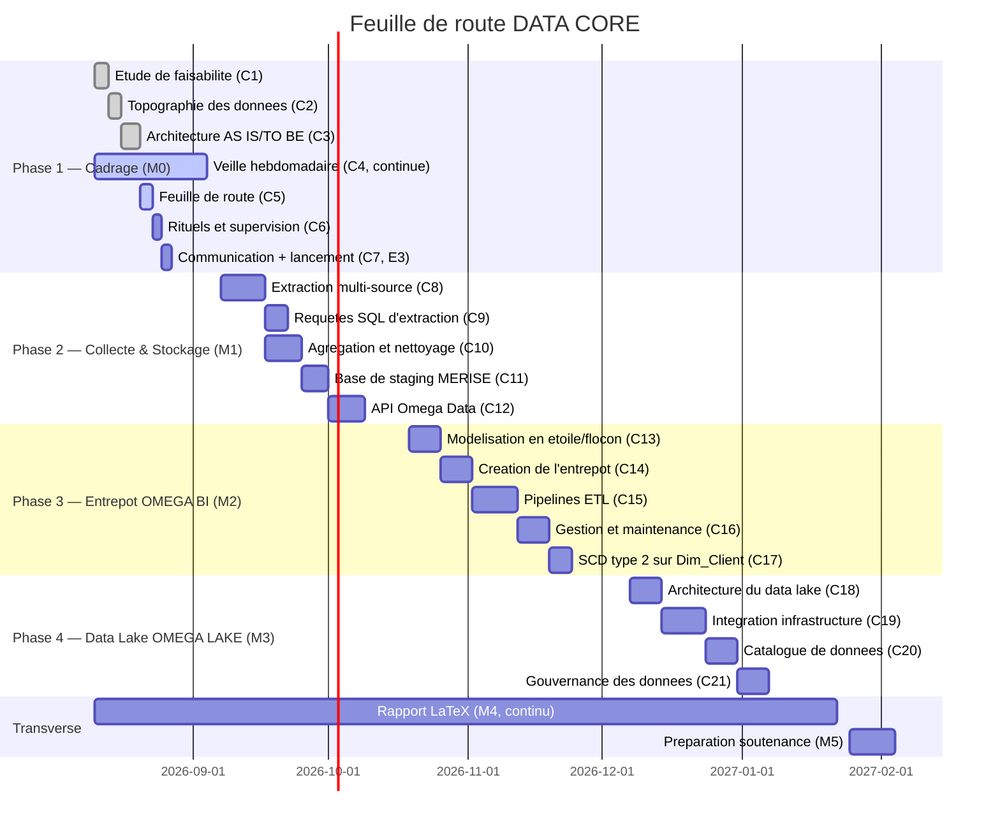
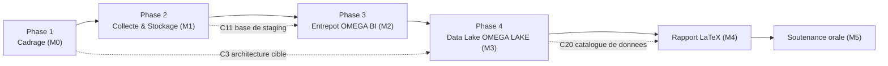

# Feuille de route du programme DATA CORE

**Compétence couverte : C5 — Planifier la réalisation d'un projet data**
**Épreuve associée : E3 (jeu de rôle « lancement d'un projet data »)**

Ce document s'appuie sur l'[étude de faisabilité](etude_faisabilite.md) (C1,
notamment l'[analyse RICE](etude_faisabilite.md#6-analyse-rice) qui a
arbitré le séquencement des blocs) et sur l'[étude technique
d'architecture](architecture_cible.md) (C3). Il définit la feuille de route
en 4 phases du programme DATA CORE, la composition de l'équipe, le budget
prévisionnel et le calendrier détaillé, ainsi que l'outil de suivi retenu.

---

## 1. Feuille de route en 4 phases

La feuille de route reprend directement le découpage en 4 blocs de
compétences du cahier des charges, chaque bloc correspondant à un
jalon (« milestone ») GitHub :

| Phase | Milestone | Objectif métier | Compétences | Épreuves |
|---|---|---|---|---|
| Phase 1 — Cadrage & Setup | M0 | Cadrer le besoin, cartographier l'existant, définir l'architecture cible, planifier et lancer le programme | C1-C7 | E1, E2, E3 |
| Phase 2 — Collecte & Stockage | M1 | Industrialiser la collecte multi-source, nettoyer et exposer un jeu de données consolidé | C8-C12 | E4 |
| Phase 3 — Entrepôt OMEGA BI | M2 | Construire et maintenir l'entrepôt décisionnel de pilotage de la performance logistique | C13-C17 | E5, E6 |
| Phase 4 — Data Lake OMEGA LAKE | M3 | Concevoir et opérer le data lake pour absorber la donnée massive IoT | C18-C21 | E7 |

Deux jalons transverses accompagnent l'ensemble du programme sans lui être
séquentiels : **M4 — Rapport LaTeX** (consolidation continue de la
documentation) et **M5 — Présentation orale** (préparation de la
soutenance finale), finalisés à l'issue de la Phase 4.

Ce séquencement respecte la priorisation établie par l'
[analyse RICE](etude_faisabilite.md#6-analyse-rice) : la centralisation de
la collecte et la conformité RGPD (Phase 2) priment sur l'entrepôt
décisionnel (Phase 3), lui-même prioritaire sur le data lake (Phase 4,
score RICE le plus bas du fait de sa complexité et de son incertitude
technique).

---

## 2. Composition de l'équipe projet

| Membre | Rôle | Contribution attendue par phase |
|---|---|---|
| Data Engineer / chef·fe de projet (moi) | Pilotage et réalisation du programme | Contributeur principal sur les 4 phases |
| Sophie MARTIN | Lead Data Engineer, référente technique | Revue technique, arbitrages d'architecture (Phases 1-4) |
| Yanis DUPONT | Data Engineer | Développement des pipelines de collecte et d'ETL (Phases 2-3) |
| Léa FONTAINE | Data Analyst | Expression des besoins d'analyse, recette de l'entrepôt OMEGA BI (Phase 3), utilisatrice de l'API (Phase 2) |
| Thomas NGUYEN | DevOps / Infrastructure | Conteneurisation, CI/CD, sécurité des accès (transverse, en soutien à partir de la Phase 1) |
| SupervIT (prestataire externe) | Intégration technique | Appui ponctuel encadré, notamment sur l'intégration des composants du data lake (Phase 4) |
| Karim BELAÏD | Commanditaire opérationnel | Arbitrages fonctionnels, validation des livrables de cadrage (Phase 1) |
| Éléonore RAKOTO | Sponsor | Décisions budgétaires, suivi en comité mensuel (CoSu), sur l'ensemble du programme |

La supervision opérationnelle de l'équipe (rituels, reporting budgétaire,
encadrement de SupervIT) fait l'objet d'un livrable dédié à la compétence
C6 ; le présent document se limite à la planification.

---

## 3. Budget prévisionnel

Le budget indicatif de 180 000 € défini au cahier des charges est réparti
par phase, en cohérence avec la charge relative de chaque bloc :

| Phase | Poste budgétaire | Montant | Répartition indicative |
|---|---|---|---|
| Phase 1 — Cadrage (M0) | Cadrage, animation, communication, veille | 25 000 € | Staffing interne (Pôle Data), pas d'outillage payant |
| Phase 2 — Collecte & Stockage (M1) | Développement des scripts d'extraction, base de données, API REST | 45 000 € | Staffing interne, hébergement local (PostgreSQL conteneurisé) |
| Phase 3 — Entrepôt de données (M2) | Modélisation, ETL, mise en production, maintenance | 55 000 € | Staffing interne, tests, procédures de sauvegarde |
| Phase 4 — Data lake et infrastructure IoT (M3) | Architecture, capteurs, stockage, catalogue, gouvernance | 55 000 € | Staffing interne + appui SupervIT (intégration), outil de catalogue |
| **Total programme** | | **180 000 €** | |

Aucun outil sous licence propriétaire n'est budgété par défaut (choix
d'architecture open source, cf. [étude technique d'architecture
§2.3](architecture_cible.md#23-choix-technologiques-proposés) et stratégie
RGESN) : le budget sert prioritairement au temps humain (Pôle Data +
SupervIT), ce qui laisse une marge de sécurité en cas d'imprévu technique.

---

## 4. Calendrier détaillé

### 4.1 Diagramme de Gantt

### 4.2 Roadmap / dépendances (PERT simplifié)

Le chemin critique suit les 4 phases dans l'ordre (A → B → C → D → E → F) :
aucune phase technique ne peut démarrer avant que la précédente ait livré
sa brique de stockage (base de staging pour la Phase 3, data lake pour la
finalisation du rapport). L'architecture cible définie en Phase 1 (C3)
conditionne directement les choix techniques de la Phase 4 (zones du data
lake définies dès le cadrage, cf. [architecture cible
§2.2](architecture_cible.md#22-vue-en-couches)).

---

## 5. Outil de suivi

Le programme est suivi via **GitHub Projects** (board « DATA CORE »,
lié au dépôt `alaugier/datacore`), choisi plutôt qu'un outil tiers
(Trello, Jira) pour rester intégré au dépôt Git et à la convention de
branches du projet :

| Élément du board | Correspondance |
|---|---|
| Colonnes (statut) | `Todo` → `In Progress` → `Done`, une carte par issue GitHub |
| Jalons | Un milestone GitHub par phase (M0 à M3) + M4/M5 transverses |
| Cartes | Une issue par livrable de compétence (ex. issue #2 = C1, issue #6 = C5) |
| Labels | `bloc-1` à `bloc-4` (phase), `docs`/`infra`/`ci` (nature du livrable) |
| Traçabilité | Chaque carte est reliée à une Pull Request (`feat-<numéro>-<nom>` → `dev`), fermée automatiquement à la fusion |

Cadence de suivi (détaillée dans le livrable C6 à venir) : point d'équipe
hebdomadaire et comité de suivi mensuel (« CoSu ») avec Éléonore RAKOTO,
positionnés en fin de chaque mois calendaire sur le Gantt ci-dessus.

---

## 6. Synthèse

La feuille de route confirme la faisabilité du calendrier envisagé dans
l'[étude de faisabilité](etude_faisabilite.md#5-étude-de-faisabilité) :
4 phases séquentielles d'environ 4 à 7 semaines chacune, un budget de
180 000 € cohérent avec le périmètre défini, et un outil de suivi déjà
opérationnel (GitHub Projects) plutôt qu'à mettre en place. Cette feuille
de route sert de support à la réunion de lancement du programme (épreuve
E3, compétence C7).
