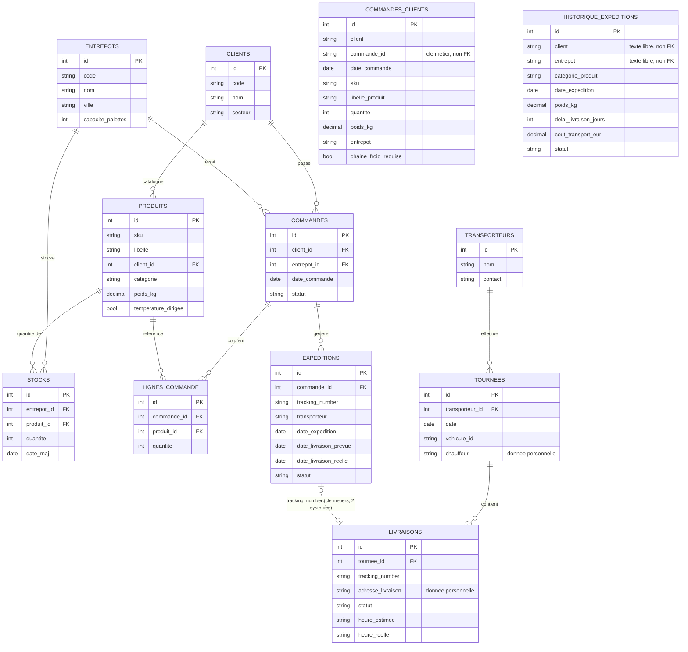

# Modélisation MERISE de la base de travail — DATA CORE

**Compétence couverte : C11 — Créer une base de données**
**Épreuve associée : E4 (mise en situation professionnelle)**

Ce document modélise la base de travail (« staging ») consolidée du
programme, conformément à l'ordre retenu dans
[`sequencement_bloc2.md`](sequencement_bloc2.md) (C8 → C10 → C9 → **C11**
→ C12) : la modélisation intervient une fois les données réellement
extraites (C8) et nettoyées (C10), avec le bénéfice d'une connaissance
concrète — pas seulement théorique — de chaque source.

---

## 1. Ce qui est pré-existant, ce que C11 crée

| Tables | Origine | Gérées par |
|---|---|---|
| `entrepots`, `clients`, `produits`, `commandes`, `lignes_commande`, `expeditions`, `stocks` | Schéma FluxPro **fourni** (`data/raw/schema.sql`) | `scripts/init_staging_db.sh` (issue #7) — import brut, pas une modélisation de notre fait |
| `historique_expeditions` | Historique volumineux, schéma que nous avons conçu (C9) | `sql/historique_schema.sql` + `scripts/load_historique.sh` |
| `transporteurs`, `tournees`, `livraisons`, `commandes_clients` | **Modélisées et créées ici (C11)** | Alembic (`src/datacore/storage/staging/`) |

Cette distinction est documentée pour éviter toute ambiguïté : la
« base de travail » désigne l'ensemble consolidé (vue d'ensemble en §2),
mais seule la seconde moitié relève d'une modélisation MERISE originale
— voir déjà le point clarifié dans
[`sequencement_bloc2.md` §2](sequencement_bloc2.md#2-ce-que-fait-déjà-linfrastructure-existante-issue-7--et-ce-quelle-ne-fait-pas).

---

## 2. Modèle conceptuel de données (MCD) — vue d'ensemble



**Entités pré-existantes** (fond du schéma FluxPro donné, C7) : `CLIENTS`,
`ENTREPOTS`, `PRODUITS`, `COMMANDES`, `LIGNES_COMMANDE`, `EXPEDITIONS`,
`STOCKS`. **Entité pré-existante conçue en C9** : `HISTORIQUE_EXPEDITIONS`.
**Entités modélisées et créées en C11** (voir
[`models.py`](../../src/datacore/storage/staging/models.py)) :
`TRANSPORTEURS`, `TOURNEES`, `LIVRAISONS`, `COMMANDES_CLIENTS`.

---

## 3. Choix de modélisation et limites

### 3.1 `EXPEDITIONS` ↔ `LIVRAISONS` : rapprochement vérifié à 100 %

FluxPro et TransFlow sont deux systèmes distincts, sans clé étrangère
formelle entre eux — le rapprochement se fait par la clé métier
`tracking_number`. **Vérification empirique** (après import complet) :

```sql
SELECT count(*) FROM livraisons l JOIN expeditions e
  ON e.tracking_number = l.tracking_number;
-- -> 1100 (= le nombre total de livraisons ET d'expéditions)
```

Les 1100 livraisons se rapprochent intégralement des 1100 expéditions :
ce lien métier est fiable à 100 % sur ce jeu de données, contrairement
au rapprochement `clients.nom` ↔ `historique_expeditions.client` (voir
§3.3) qui reste, lui, non vérifié formellement.

### 3.2 `COMMANDES_CLIENTS` reste une entité indépendante

Les commandes brutes des clients (C10) utilisent leur propre
identifiant (`ref_commande`, `id_commande_client`, `numero_cde` — unifiés
sous `commande_id`), qui n'a **aucune correspondance connue** avec
`commandes.id` côté FluxPro : ce sont deux processus distincts
(réception de la demande client vs. commande traitée par Omega), et le
jeu de données pédagogique ne fournit pas de clé métier commune pour les
relier. Plutôt que de forcer une jointure arbitraire (ex. sur la date et
l'entrepôt, trop fragile), `commandes_clients` est modélisée comme une
entité **indépendante** — un rapprochement réel nécessiterait qu'Omega
Logistics attribue un identifiant de commande partagé entre son système
et ceux de ses clients, ce qui est hors du périmètre de ce programme.

### 3.3 `HISTORIQUE_EXPEDITIONS.client` reste en texte libre

Limite déjà documentée en C9
([`requetes_sql_extraction.md` §3](requetes_sql_extraction.md#3-point-de-vigilance-pour-c11c13)) :
l'historique utilise un libellé client texte (`"NordDrive"`) plutôt
qu'une clé étrangère vers `clients.id`. Un rapprochement (`clients.nom =
historique_expeditions.client`) est possible en requête mais non
garanti par une contrainte — à traiter formellement lors de la
modélisation de l'entrepôt de données (bloc 3, C13).

---

## 4. Gestion des migrations avec Alembic

Décision actée le 25/08/2026 : les évolutions du schéma des tables
modélisées par C11 sont versionnées via **Alembic**, plutôt que par des
scripts SQL manuels (comme pour le bootstrap FluxPro/historique) — accès
à l'historique des changements, capacité de rollback, cohérence entre
environnements.

```bash
# Appliquer toutes les migrations
alembic upgrade head

# Revenir en arrière (retire les 4 tables C11, laisse FluxPro/historique intactes)
alembic downgrade base

# Créer une nouvelle révision après modification de models.py
alembic revision --autogenerate -m "description du changement"
```

Le DSN de connexion est lu depuis `datacore.ingestion.config.STAGING_DB_DSN`
(donc depuis `.env` via `python-dotenv`) — voir
`src/datacore/storage/staging/migrations/env.py` — pas codé en dur dans
`alembic.ini`, pour n'avoir qu'une seule source de vérité sur la chaîne
de connexion.

**Point de vigilance vérifié** : `alembic revision --autogenerate`
propose par défaut de supprimer toute table absente de nos métadonnées
SQLAlchemy — y compris les tables FluxPro/historique, pré-existantes et
hors périmètre. Ces `drop_table`/`create_table` erronés ont été retirés
à la main de la première révision (voir le commentaire en tête du
fichier de migration) ; à vérifier systématiquement à chaque nouvelle
révision générée.

---

## 5. Script d'import documenté

[`src/datacore/storage/staging/load_staging.py`](../../src/datacore/storage/staging/load_staging.py)
charge les résultats des zones d'atterrissage C8/C10 dans les 4 tables
nouvellement créées :

```bash
alembic upgrade head
python3 -m datacore.ingestion.run_extraction    # C8
python3 -m datacore.processing.run_cleaning     # C10
python3 -m datacore.storage.staging.load_staging
```

- `transporteurs`, `tournees`, `livraisons` : les identifiants **d'origine
  TransFlow** sont préservés à l'import (nécessaire pour respecter les
  clés étrangères entre elles), avec resynchronisation de la séquence
  Postgres après coup (`setval`).
- `commandes_clients` : pas d'identifiant source (la clé naturelle de
  C10 est le triplet client/commande_id/sku) — l'`id` est généré par la
  base à l'insertion.

Testé de bout en bout (Docker Compose) : 3 transporteurs, 139 tournées,
1100 livraisons, 3593 commandes clients importés avec succès,
intégrité référentielle vérifiée (0 tournée orpheline).

---

## 6. RGPD

Le registre des traitements de données personnelles et les procédures
de tri associées à cette base de travail sont documentés séparément :
[`registre_rgpd.md`](registre_rgpd.md).
