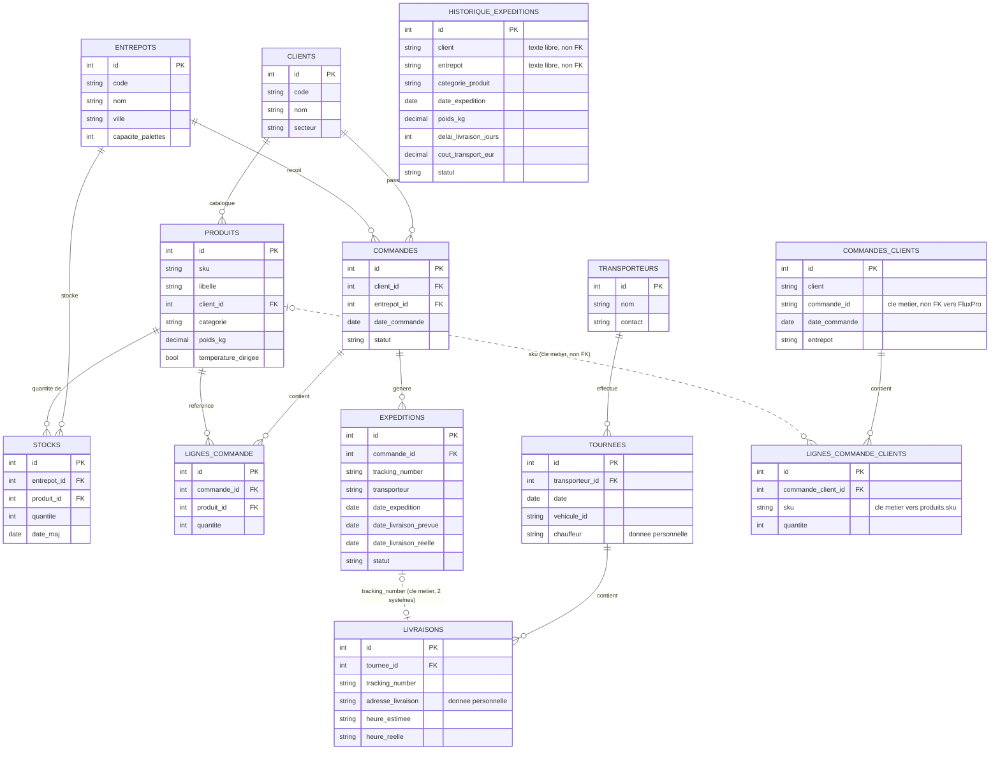

# Modélisation MERISE de la base de travail — DATA CORE

**Compétence couverte : C11 — Créer une base de données**
**Épreuve associée : E4 (mise en situation professionnelle)**

Ce document modélise la base de travail (« staging ») consolidée du
programme, conformément à l'ordre retenu dans
[`sequencement_bloc2.md`](sequencement_bloc2.md) (C8 → C10 → C9 → **C11**
→ C12) : la modélisation intervient une fois les données réellement
extraites (C8) et nettoyées (C10), avec le bénéfice d'une connaissance
concrète — pas seulement théorique — de chaque source.

Le schéma décrit ici est la **version normalisée** (26/08/2026), revue
après une analyse des formes normales (§3) qui a mis au jour deux
violations réelles dans la première version — corrigées après
vérification empirique, pas par principe.

---

## 1. Ce qui est pré-existant, ce que C11 crée

| Tables | Origine | Gérées par |
|---|---|---|
| `entrepots`, `clients`, `produits`, `commandes`, `lignes_commande`, `expeditions`, `stocks` | Schéma FluxPro **fourni** (`data/raw/schema.sql`) | `scripts/init_staging_db.sh` (issue #7) — import brut, pas une modélisation de notre fait |
| `historique_expeditions` | Historique volumineux, schéma que nous avons conçu (C9) | `sql/historique_schema.sql` + `scripts/load_historique.sh` |
| `transporteurs`, `tournees`, `livraisons` (+ vue `livraisons_avec_statut`), `commandes_clients`, `lignes_commande_clients` | **Modélisées et créées ici (C11)** | Alembic (`src/datacore/storage/staging/`) |

Cette distinction est documentée pour éviter toute ambiguïté : la
« base de travail » désigne l'ensemble consolidé (vue d'ensemble en §2),
mais seule la seconde moitié relève d'une modélisation MERISE originale
— voir déjà le point clarifié dans
[`sequencement_bloc2.md` §2](sequencement_bloc2.md#2-ce-que-fait-déjà-linfrastructure-existante-issue-7--et-ce-quelle-ne-fait-pas).

---

## 2. Modèle conceptuel de données (MCD) — vue d'ensemble



**Note sur `livraisons` / `statut`** : la table ne stocke plus `statut`
(voir §3.3) ; une vue SQL `livraisons_avec_statut` le recalcule à la
lecture (`CASE WHEN heure_reelle IS NOT NULL THEN 'Livree' ELSE 'En
cours' END`). Une vue n'est pas une entité MERISE et n'apparaît donc pas
dans le MCD ci-dessus — voir §4 (Alembic) pour sa création.

**Entités pré-existantes** (fond du schéma FluxPro donné, C7) : `CLIENTS`,
`ENTREPOTS`, `PRODUITS`, `COMMANDES`, `LIGNES_COMMANDE`, `EXPEDITIONS`,
`STOCKS`. **Entité pré-existante conçue en C9** : `HISTORIQUE_EXPEDITIONS`.
**Entités modélisées et créées en C11** (voir
[`models.py`](../../src/datacore/storage/staging/models.py)) :
`TRANSPORTEURS`, `TOURNEES`, `LIVRAISONS`, `COMMANDES_CLIENTS`,
`LIGNES_COMMANDE_CLIENTS`.

---

## 3. Analyse des formes normales

Vérification systématique des 4 tables modélisées par C11, avec
dépendances fonctionnelles vérifiées empiriquement sur les données
réelles plutôt que supposées.

### 3.1 1NF (première forme normale)

Les 4 tables la respectent : valeurs atomiques, pas de groupes
répétitifs, chaque ligne identifiable par une clé (surrogate `id` ou clé
métier).

### 3.2 `transporteurs` et `tournees` : 3NF (voire BCNF) sans réserve

- `transporteurs(id, nom, contact)` : clé simple, aucune dépendance
  transitive possible entre `nom` et `contact`. 3NF/BCNF triviale.
- `tournees(id, transporteur_id, date, vehicule_id, chauffeur)` :
  hypothèse testée avant de conclure — `vehicule_id` pourrait-il
  déterminer `chauffeur` (un véhicule toujours conduit par la même
  personne) ? Vérifié sur les 139 tournées : **non**, les 15 véhicules
  ont chacun plusieurs chauffeurs différents (ex. `VH-004` : 12
  chauffeurs distincts). Aucune dépendance transitive cachée. 3NF
  confirmée.

### 3.3 `livraisons` : violation de 3NF corrigée (`statut` retiré)

Hypothèse testée : `statut` est-il redondant avec `heure_reelle` ?
Vérifié sur les 1100 livraisons :

| `heure_reelle` renseignée | `statut` observé |
|---|---|
| Oui | toujours `Livree` |
| Non | toujours `En cours` |

Corrélation à 100 %, sans exception : `statut` est **transitivement
dépendant** de `heure_reelle` (un attribut non-clé déterminé par un
autre attribut non-clé) — violation de 3NF.

**Correction retenue : une vue SQL plutôt qu'une colonne stockée.**
Une colonne générée (`GENERATED ALWAYS AS ... STORED`) aurait supprimé
le *risque d'incohérence* (plus possible d'insérer un couple
`statut`/`heure_reelle` contradictoire) mais aurait conservé une
*redondance physique* sur disque. La vue `livraisons_avec_statut`
élimine complètement la redondance : `statut` n'existe nulle part en
stockage, il est recalculé à chaque lecture. Ce choix privilégie la
lisibilité du schéma pour un évaluateur qui le relit (`livraisons` ne
contient que des faits primaires) au prix d'un (léger) coût de calcul à
la lecture — non significatif à l'échelle de ce jeu de données.

```sql
CREATE VIEW livraisons_avec_statut AS
SELECT *,
    CASE WHEN heure_reelle IS NOT NULL THEN 'Livree' ELSE 'En cours' END AS statut
FROM livraisons;
```

### 3.4 `commandes_clients` : violation de 2NF corrigée (décomposition)

La première version de cette table était plate (un enregistrement par
ligne de commande, clé naturelle `(client, commande_id, sku)`).
Hypothèses testées sur les 3 fichiers clients bruts avant décomposition :

| Attribut | Dépend réellement de | Vérification |
|---|---|---|
| `libelle_produit` | `sku` seul | 0 exception sur 30 sku (10 par client) |
| `poids_kg` (NordDrive) | `sku` seul | 0 exception sur 10 sku, **et** valeur identique à `produits.poids_kg` (FluxPro) sur les 10 |
| `chaine_froid_requise` (FreshMarket) | `sku` seul | 0 exception sur 10 sku, **et** valeur identique à `produits.temperature_dirigee` (FluxPro) sur les 10 |
| `date_commande`, `entrepot` | `(client, commande_id)` seul, pas besoin de `sku` | 0 exception sur 1396 commandes |
| `quantite` | la clé complète `(client, commande_id, sku)` | dépendance légitime, pas de violation |

Trois attributs (`libelle_produit`, `poids_kg`, `chaine_froid_requise`)
dépendent uniquement de `sku` — et se sont révélés, en plus, **entièrement
redondants** avec `produits.libelle`, `produits.poids_kg` et
`produits.temperature_dirigee` côté FluxPro (0 écart mesuré). Deux
attributs (`date_commande`, `entrepot`) dépendent de `(client,
commande_id)` sans besoin de `sku`. Dans les deux cas : dépendance
partielle sur une clé composite → violation de 2NF.

**Correction retenue : décomposition en-tête / lignes**, sur le même
principe que `commandes`/`lignes_commande` côté FluxPro :

- `commandes_clients(id, client, commande_id, date_commande, entrepot)`
  — un en-tête par commande, `UNIQUE(client, commande_id)`.
- `lignes_commande_clients(id, commande_client_id FK, sku, quantite)` —
  une ligne par produit commandé, `libelle_produit`/`poids_kg`/
  `chaine_froid_requise` obtenus par jointure sur `produits.sku` plutôt
  que dupliqués.

Pas de contrainte `FOREIGN KEY` formelle sur `sku` : `produits.sku`
n'est pas contraint `UNIQUE` dans le schéma FluxPro fourni (seul
`produits.id` est clé primaire), donc Postgres ne peut pas y accrocher
de clé étrangère sans modifier ce schéma externe — hors périmètre (même
principe que pour `tracking_number`, §4.1 ci-après). L'intégrité a été
vérifiée empiriquement : 0 ligne orpheline sur les 3593 lignes
importées.

### 3.5 4NF et 5NF

Aucune violation supplémentaire identifiée au-delà de celles déjà
traitées en 2NF/3NF : une fois `livraisons` et `commandes_clients`
corrigées, chaque table restante représente un fait atomique unique par
ligne (une tournée, une livraison, un en-tête de commande, une ligne de
commande), sans dépendance multivaluée ni anomalie de jointure
résiduelle. Non applicable à ce schéma de taille modeste.

---

## 4. Choix de modélisation et limites

### 4.1 `EXPEDITIONS` ↔ `LIVRAISONS` : rapprochement vérifié à 100 %

FluxPro et TransFlow sont deux systèmes distincts, sans clé étrangère
formelle entre eux — le rapprochement se fait par la clé métier
`tracking_number`. **Vérification empirique** (après import complet) :

```sql
SELECT count(*) FROM livraisons l JOIN expeditions e
  ON e.tracking_number = l.tracking_number;
-- -> 1100 (= le nombre total de livraisons ET d'expéditions)
```

Les 1100 livraisons se rapprochent intégralement des 1100 expéditions :
ce lien métier est fiable à 100 % sur ce jeu de données, contrairement
au rapprochement `clients.nom` ↔ `historique_expeditions.client` (voir
§4.3) qui reste, lui, non vérifié formellement.

### 4.2 `COMMANDES_CLIENTS` reste indépendante de `COMMANDES` (FluxPro)

Les commandes brutes des clients (C10) utilisent leur propre
identifiant (`ref_commande`, `id_commande_client`, `numero_cde` — unifiés
sous `commande_id`), qui n'a **aucune correspondance connue** avec
`commandes.id` côté FluxPro : ce sont deux processus distincts
(réception de la demande client vs. commande traitée par Omega), et le
jeu de données pédagogique ne fournit pas de clé métier commune pour les
relier. Plutôt que de forcer une jointure arbitraire (ex. sur la date et
l'entrepôt, trop fragile), `commandes_clients` est modélisée comme une
entité **indépendante** — un rapprochement réel nécessiterait qu'Omega
Logistics attribue un identifiant de commande partagé entre son système
et ceux de ses clients, ce qui est hors du périmètre de ce programme.
En revanche, le rapprochement `lignes_commande_clients.sku` ↔
`produits.sku` est, lui, vérifié fiable à 100 % (§3.4).

### 4.3 `HISTORIQUE_EXPEDITIONS.client` reste en texte libre

Limite déjà documentée en C9
([`requetes_sql_extraction.md` §3](requetes_sql_extraction.md#3-point-de-vigilance-pour-c11c13)) :
l'historique utilise un libellé client texte (`"NordDrive"`) plutôt
qu'une clé étrangère vers `clients.id`. Un rapprochement (`clients.nom =
historique_expeditions.client`) est possible en requête mais non
garanti par une contrainte — à traiter formellement lors de la
modélisation de l'entrepôt de données (bloc 3, C13).

---

## 5. Gestion des migrations avec Alembic

Décision actée le 25/08/2026 : les évolutions du schéma des tables
modélisées par C11 sont versionnées via **Alembic**, plutôt que par des
scripts SQL manuels (comme pour le bootstrap FluxPro/historique) — accès
à l'historique des changements, capacité de rollback, cohérence entre
environnements.

```bash
# Appliquer toutes les migrations
alembic upgrade head

# Revenir en arrière (retire les 5 tables + la vue C11, laisse FluxPro/historique intacts)
alembic downgrade base

# Créer une nouvelle révision après modification de models.py
alembic revision --autogenerate -m "description du changement"
```

Le DSN de connexion est lu depuis `datacore.ingestion.config.STAGING_DB_DSN`
(donc depuis `.env` via `python-dotenv`) — voir
`src/datacore/storage/staging/migrations/env.py` — pas codé en dur dans
`alembic.ini`, pour n'avoir qu'une seule source de vérité sur la chaîne
de connexion.

**Point de vigilance vérifié** : `alembic revision --autogenerate`
propose par défaut de supprimer toute table absente de nos métadonnées
SQLAlchemy — y compris les tables FluxPro/historique, pré-existantes et
hors périmètre. Ces `drop_table`/`create_table` erronés ont été retirés
à la main de la révision (voir le commentaire en tête du fichier de
migration) ; à vérifier systématiquement à chaque nouvelle révision
générée. La vue `livraisons_avec_statut` n'est pas modélisable comme
`Table` SQLAlchemy classique : créée/supprimée via `op.execute()` en SQL
brut, directement dans la migration.

`alembic upgrade head` puis `alembic downgrade base` ont été testés tous
les deux contre une vraie base : les 5 tables et la vue sont créées puis
retirées proprement, sans jamais toucher aux tables FluxPro/historique.

---

## 6. Script d'import documenté

[`src/datacore/storage/staging/load_staging.py`](../../src/datacore/storage/staging/load_staging.py)
charge les résultats des zones d'atterrissage C8/C10 dans les tables
nouvellement créées, **dans une transaction unique** : un échec sur
n'importe quelle étape déclenche un `ROLLBACK` complet plutôt que de
laisser la base partiellement peuplée.

```bash
alembic upgrade head
python3 -m datacore.ingestion.run_extraction    # C8
python3 -m datacore.processing.run_cleaning     # C10
python3 -m datacore.storage.staging.load_staging
```

- `transporteurs`, `tournees`, `livraisons` : les identifiants **d'origine
  TransFlow** sont préservés à l'import (nécessaire pour respecter les
  clés étrangères entre elles), avec resynchronisation de la séquence
  Postgres après coup (`setval`). `statut` n'est plus inséré (§3.3).
- `commandes_clients` / `lignes_commande_clients` : le jeu consolidé de
  C10 (une ligne par produit) est d'abord dédupliqué sur `(client,
  commande_id)` pour produire les en-têtes (un `INSERT ... RETURNING id`
  par commande, capturé dans un dictionnaire de correspondance), puis
  les lignes sont insérées en référençant l'`id` d'en-tête approprié.
  `libelle_produit`/`poids_kg`/`chaine_froid_requise` ne sont pas
  importés (§3.4).

Testé de bout en bout (Docker Compose) : 3 transporteurs, 139 tournées,
1100 livraisons, **1396 en-têtes de commandes clients** (= nombre de
commandes uniques dans le jeu consolidé), **3593 lignes** importées avec
succès. Intégrité vérifiée : 0 tournée orpheline, 0 ligne de commande
sans produit correspondant, vue `livraisons_avec_statut` cohérente
(761 `Livree` + 339 `En cours` = 1100).

---

## 7. RGPD

Le registre des traitements de données personnelles et les procédures
de tri associées à cette base de travail sont documentés séparément :
[`registre_rgpd.md`](registre_rgpd.md).
