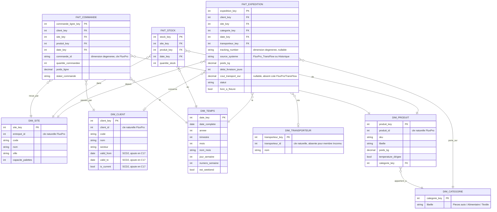

# Modélisation OMEGA BI — schémas étoile et flocon

**Compétence couverte : C13 — Modéliser un entrepôt de données**
**Épreuve associée : E5**

Ce document modélise l'entrepôt de données décisionnel « OMEGA BI »,
alimenté par la base de travail du Bloc 2 (C8-C12) et par l'historique
des expéditions (C9). Il précède la création physique de l'entrepôt
(C14) et les pipelines ETL (C15) : c'est un livrable de conception, pas
d'implémentation.

---

## 1. Approche retenue : bottom-up par datamarts, dimensions conformées

Conformément à l'issue #44 et à la méthode Kimball, l'entrepôt est
construit **par datamart** (processus métier), plutôt que par un modèle
unique et monolithique couvrant tout le périmètre décisionnel d'un
coup :

- **Datamart « Exploitation »** : pilotage opérationnel du transport et
  du stock (`Fait_Expedition`, `Fait_Stock`).
- **Datamart « Commercial »** : suivi des commandes traitées par Omega
  pour le compte de ses clients (`Fait_Commande`).

Les deux datamarts partagent des **dimensions conformées**
(`Dim_Client`, `Dim_Site`, `Dim_Temps`, `Dim_Produit`/`Dim_Categorie`) :
une même clé de dimension a le même sens et le même grain dans les deux
datamarts, ce qui permet des analyses transverses (ex. « taux de service
par client » en croisant `Fait_Expedition` et `Fait_Commande` sur
`Dim_Client`) sans dupliquer la logique de dimension. C'est le principe
central de l'approche bottom-up : chaque datamart est livrable et utile
seul, et l'ensemble converge vers un entrepôt cohérent au fur et à
mesure (C14 crée « Exploitation » et « Commercial » — voir issue #45).

---

## 2. Sources mobilisées

| Source | Origine | Contenu utile ici |
|---|---|---|
| `clients`, `entrepots`, `produits` | FluxPro (fourni) | Référentiels — alimentent les dimensions |
| `commandes`, `lignes_commande` | FluxPro (fourni) | Commandes traitées par Omega — `Fait_Commande` |
| `expeditions` | FluxPro (fourni) | Expéditions liées aux commandes — `Fait_Expedition` |
| `transporteurs`, `tournees`, `livraisons` (+ vue `livraisons_avec_statut`) | Modélisées en C11 | Détail transport — `Fait_Expedition` |
| `stocks` | FluxPro (fourni) | Niveaux de stock — `Fait_Stock` |
| `historique_expeditions` | Conçue en C9 | Expéditions historiques agrégées — alimente aussi `Fait_Expedition`, à un grain plus grossier (voir §5.1) |
| `commandes_clients` / `lignes_commande_clients` | Modélisées en C11 | **Non mobilisées** dans cette itération — voir §6.1 |

**Rappel du point déjà vérifié empiriquement** (préalable à cette
modélisation) :
[`notebooks/verification_rapprochement_commandes.ipynb`](../../notebooks/verification_rapprochement_commandes.ipynb)
a confirmé que `commandes_clients` (demandes brutes des clients) et
`commandes` (FluxPro, commandes réellement traitées) ne peuvent pas être
rapprochées de manière fiable — clé candidate ambiguë sur 13,6 % des cas,
et l'historique ne fournit aucun pont. Conséquence directe pour ce
document : `Fait_Commande` est construit sur `commandes`/`lignes_commande`
(FluxPro) uniquement — voir §6.1 pour la justification de ne pas modéliser
`commandes_clients` comme un fait séparé dans cette itération.

---

## 3. Matrice de bus (Bus Matrix)

| Fait \ Dimension | Dim_Client | Dim_Site | Dim_Produit | Dim_Categorie | Dim_Temps | Dim_Transporteur |
|---|:---:|:---:|:---:|:---:|:---:|:---:|
| **Fait_Expedition** (Exploitation) | ✓ | ✓ | | ✓ | ✓ | ✓ (nullable) |
| **Fait_Stock** (Exploitation) | | ✓ | ✓ | | ✓ | |
| **Fait_Commande** (Commercial) | ✓ | ✓ | ✓ | | ✓ | |

`Dim_Produit` et `Dim_Categorie` ne sont **jamais utilisées ensemble par
le même fait** : `Fait_Expedition` référence `Dim_Categorie` (grain
disponible pour les deux sources, voir §5.1), `Fait_Stock` et
`Fait_Commande` référencent `Dim_Produit` (grain SKU, disponible sur
leur unique source FluxPro). C'est le choix de flocon détaillé en §7.

---

## 4. Vue d'ensemble (MCD)

---

## 5. Tables de faits

### 5.1 `Fait_Expedition` (datamart Exploitation)

**Grain : une ligne par événement d'expédition.**

Deux sources alimentent ce fait, à des grains de détail différents —
c'est la raison du choix `Dim_Categorie` plutôt que `Dim_Produit` en
§3/§7 :

| | FluxPro/TransFlow (`expeditions` + `livraisons`) | Historique (`historique_expeditions`) |
|---|---|---|
| Volume | 1100 lignes | 25 000 lignes |
| Lien vers une commande | Oui (`commande_id`, via `expeditions`) | Non |
| Produit | Détail SKU (via `commande_id` → `lignes_commande` → `produits`) | Catégorie seule (`categorie_produit`) |
| Transporteur | Connu, mais en texte libre (`expeditions.transporteur`, ex. `"RapidFret"`) — pas de FK vers `transporteurs.id` (point déjà noté dans `topographie_donnees.md` : jointure applicative nécessaire, voir note ci-dessous) | **Absent** de la source (aucune colonne transporteur) |
| Coût de transport | **Absent** (ni `expeditions` ni `livraisons` ne portent de coût) | Connu (`cout_transport_eur`) |
| Rapprochement client/entrepôt | Fiable (clés étrangères) | Texte libre (`client`, `entrepot`) — non garanti par contrainte, mais vérifié cohérent avec les 3 clients et 3 entrepôts connus sur ce jeu de données (voir `modelisation_merise.md` §4.3 pour la réserve déjà documentée) |

**Rapprochement `expeditions.transporteur` ↔ `Dim_Transporteur`** : côté
FluxPro, `expeditions.transporteur` est un texte libre (`"RapidFret"`,
`"EcoRoute"`, `"TransUnion Logistique"`), pas une clé étrangère vers
`transporteurs.id` — le chargement de `Fait_Expedition` doit donc
rapprocher cette valeur de `Dim_Transporteur.nom` par **jointure
textuelle exacte**, avec le même risque de principe qu'un rapprochement
`client`/`entrepot` en texte libre (variante d'orthographe, casse,
espace). Vérifié empiriquement sur ce jeu de données : les 3 valeurs de
`expeditions.transporteur` correspondent exactement aux 3 valeurs de
`transporteurs.nom` (source `api-mock/fixtures/transporteurs.json`),
aucun écart. Comme pour le rapprochement client/entrepôt de
l'historique, ce n'est pas garanti par une contrainte — à traiter comme
un contrôle qualité explicite en C15 (ligne rejetée ou mise en
quarantaine si `expeditions.transporteur` ne correspond à aucun
`transporteurs.nom` connu), pas supposé automatiquement fiable en
production (voir §8).

Ce tableau documente une asymétrie réelle du jeu de données, pas un
choix de modélisation : le système « historique » et le couple
FluxPro/TransFlow ne mesurent pas exactement la même chose (coût côté
historique, détail produit et transporteur côté FluxPro/TransFlow).
`Fait_Expedition` est conçu pour absorber les deux, avec :

- une **dimension dégénérée** `source_systeme` pour distinguer l'origine
  de chaque ligne à l'analyse ;
- des clés de dimension **nullables** (`transporteur_key`, `client_key`)
  et une mesure **nullable** (`cout_transport_eur`) là où la source ne
  fournit pas l'information — plutôt que de forcer une valeur par
  défaut trompeuse ;
- `tracking_number` en dimension dégénérée, présent uniquement côté
  FluxPro/TransFlow (l'historique n'a pas d'identifiant d'expédition).

**Mesures** : `poids_kg`, `delai_livraison_jours`, `cout_transport_eur`
(nullable), `statut`, `livre_a_lheure` (booléen dérivé, même logique que
`taux_service_par_client` déjà implémenté côté API C12).

**Point de vigilance pour C15** : côté FluxPro, `poids_kg` n'existe pas
directement sur `expeditions` — à calculer en sommant
`lignes_commande.quantite × produits.poids_kg` pour la commande liée.
Côté historique, `poids_kg` est une colonne directe. Deux règles de
transformation différentes pour la même mesure — à documenter dans le
pipeline ETL (C15), pas traité ici.

### 5.2 `Fait_Stock` (datamart Exploitation)

**Grain : une ligne par (entrepôt, produit, date).**

Conçu comme une **periodic snapshot fact table** (grain journalier) au
sens Kimball, pour permettre l'alimentation future d'un historique de
stock. **Limite du jeu de données actuel** : `stocks.csv` ne fournit
qu'un instantané unique (90 lignes = 3 entrepôts × 30 produits, une
seule ligne par couple), pas une série temporelle — la table sera donc
peuplée avec une seule date de référence tant qu'aucun second
chargement n'est disponible. Le modèle n'est pas limité par ce constat :
il est conçu pour recevoir un nouvel instantané à chaque exécution
future du pipeline ETL (C15).

**Mesure** : `quantite_stock` — **semi-additive** (sommable sur
`Dim_Site`/`Dim_Produit`, jamais sur `Dim_Temps` : additionner un stock
sur plusieurs dates n'a pas de sens métier).

### 5.3 `Fait_Commande` (datamart Commercial)

**Grain : une ligne par ligne de commande FluxPro** (`lignes_commande`,
une ligne par produit commandé).

Construit sur `commandes` + `lignes_commande` (FluxPro) — voir §2 pour
le rappel du choix d'exclure `commandes_clients` de cette itération, et
§6.1 pour sa justification complète.

**Mesures** : `quantite_commandee`, `poids_ligne`
(`quantite × produits.poids_kg`). Le jeu de données ne porte aucune
colonne de prix/tarif (`produits.csv` n'a pas de champ `prix`) : aucune
mesure de chiffre d'affaires n'est modélisable ici — limite du jeu de
données pédagogique, pas un oubli.

**Dimension dégénérée** : `commande_id` (clé FluxPro), pour permettre un
regroupement par commande (une commande = plusieurs lignes) sans créer
de dimension supplémentaire pour un identifiant sans attribut propre.

`statut_commande` (`Livree`/`Expediee`/`En preparation`/`Annulee`, porté
au niveau commande dans la source) est dénormalisé sur chaque ligne du
fait plutôt que modélisé comme une dimension séparée : seulement 4
valeurs possibles, sans attribut additionnel — une dimension dédiée
n'apporterait rien qu'un attribut dégénéré n'apporte déjà, conformément
au principe de ne pas multiplier les tables sans bénéfice réel (même
logique que la décision C11 §3.4 sur `quantite`).

**Lien avec `Fait_Expedition`** : `Fait_Commande.commande_id` correspond
à `Fait_Expedition.tracking_number` via `expeditions.commande_id` — mais
ce lien n'est **pas modélisé comme une clé étrangère entre les deux
tables de faits** (anti-pattern Kimball : les faits ne se référencent
pas directement entre eux). Une analyse croisée commande → expédition se
fait par *drill-across* sur les dimensions conformées
(`Dim_Client`, `Dim_Temps`), pas par jointure directe fait-à-fait.

---

## 6. Dimensions

### 6.1 `Dim_Client`

Issue de `clients` (`id`, `code`, `nom`, `secteur`). **Clé de substitution
(`client_key`) retenue dès cette itération**, distincte de la clé
naturelle FluxPro (`client_id`) — pratique Kimball standard pour toute
dimension, indépendamment d'un besoin de SCD immédiat. Ce choix anticipe
explicitement **C17 (SCD2 sur `Dim_Client`)** : lorsque C17 sera
implémenté, l'ajout des colonnes `valid_from`/`valid_to`/`is_current`
sera une évolution additive du schéma (une même entreprise cliente
pourra alors avoir plusieurs lignes `Dim_Client`, chacune avec sa propre
`client_key`), pas une refonte — voir `sequencement_bloc3.md` §2 pour la
justification de l'ordre C17 avant C16.

**Pourquoi `commandes_clients` n'est pas un fait ici** : le jeu de
données pédagogique ne fournit aucune clé métier partagée entre les
demandes brutes des clients et les commandes réellement traitées par
Omega (vérifié empiriquement, §2). Modéliser `commandes_clients` comme
un fait indépendant sans possibilité de le relier à `Dim_Produit` de
façon fiable (le rapprochement `sku` existe, mais sans lien vers
`commande_id`/`entrepot_id`/`date_commande` de FluxPro) n'apporterait
aucune capacité d'analyse transverse avec les autres faits de cet
entrepôt — contrairement à `Fait_Commande`, qui bénéficie de dimensions
conformées fiables. Cohérent avec le choix déjà fait pour l'API C12
(`api_omega_data.md` §2.2) de ne pas exposer les tables FluxPro brutes
directement : une décision de périmètre assumée, pas un oubli. À
revisiter si Omega Logistics fournit un jour un identifiant de commande
partagé entre son système et ceux de ses clients (déjà noté comme piste
future dans `modelisation_merise.md` §4.2).

### 6.2 `Dim_Site`

Issue de `entrepots` (`id`, `code`, `nom`, `ville`, `capacite_palettes`).
Dimension plate (étoile) : 3 entrepôts seulement, aucun attribut
justifiant une décomposition en flocon.

### 6.3 `Dim_Produit` et `Dim_Categorie` — le choix de flocon

`Dim_Produit` (`produit_key`, `sku`, `libelle`, `poids_kg`,
`temperature_dirigee`) référence `Dim_Categorie` (`categorie_key`,
`libelle`) plutôt que de porter `categorie` comme attribut plat.

**Justification** (voir §7 pour la synthèse étoile/flocon) : ce n'est
**pas** une normalisation de confort (3 catégories seulement, aucun gain
de volume) mais une nécessité fonctionnelle — `historique_expeditions`
ne fournit que la catégorie (`categorie_produit`), jamais un SKU
précis. Pour que `Fait_Expedition` puisse référencer une dimension
produit cohérente quelle que soit sa source, il faut une dimension au
grain **catégorie**, disponible pour les deux origines. `Dim_Categorie`
joue ce rôle de dimension conformée à grain réduit (« shrunken
dimension » au sens Kimball) : `Fait_Expedition` la référence
directement, tandis que `Fait_Stock` et `Fait_Commande` (sources FluxPro
uniquement, toujours au grain SKU) référencent `Dim_Produit`, qui
elle-même pointe vers `Dim_Categorie`. Un flocon, mais motivé par une
contrainte réelle des sources — pas systématique.

### 6.4 `Dim_Temps`

Dimension calendaire standard, générée (pas issue d'une table source) :
`date_key`, `date_complete`, `annee`, `trimestre`, `mois`, `nom_mois`,
`jour_semaine`, `numero_semaine`, `est_weekend`. Volontairement plate
(étoile) : dénormaliser la hiérarchie calendaire dans une seule table est
la pratique Kimball standard pour cette dimension, très fréquemment
jointe et de taille modeste.

### 6.5 `Dim_Transporteur`

Issue de `transporteurs`, **`nom` uniquement** — `contact` est exclu
volontairement. Comme documenté dans
[`registre_rgpd.md`](registre_rgpd.md#1-données-personnelles-réellement-présentes),
`transporteurs.contact` est une donnée personnelle (contact
professionnel individuel), retenue dans la base de travail pour la
relation contractuelle (finalité opérationnelle précise), mais sans
utilité de reporting décisionnel — RGPD *by design* : ne pas faire
transiter vers l'entrepôt une donnée personnelle dont aucune analyse
prévue n'a besoin, plutôt que de la filtrer après coup. Un membre
« Inconnu » (`transporteur_key` réservée, sans `transporteur_id`) couvre
les lignes de `Fait_Expedition` issues de l'historique, qui ne portent
pas cette information.

`tournees.chauffeur` et `livraisons.adresse_livraison` (les deux autres
données personnelles du registre RGPD) ne sont mobilisées par **aucune**
dimension ou mesure de ce modèle — l'entrepôt OMEGA BI n'en a
structurellement pas besoin, contrairement à la base de travail dont le
périmètre opérationnel les justifie.

---

## 7. Synthèse étoile / flocon

| Dimension | Choix | Justification |
|---|---|---|
| `Dim_Client` | Étoile (+ SCD2 en C17) | Peu d'attributs, pas de hiérarchie à normaliser |
| `Dim_Site` | Étoile | 3 entrepôts, aucun gain à normaliser |
| `Dim_Produit` → `Dim_Categorie` | **Flocon** | Nécessité fonctionnelle : `Dim_Categorie` sert de dimension conformée à grain réduit pour les sources sans détail SKU (historique) |
| `Dim_Temps` | Étoile | Pratique Kimball standard pour le calendrier |
| `Dim_Transporteur` | Étoile | Peu d'attributs (après exclusion RGPD de `contact`) |

Le flocon n'est donc pas appliqué par défaut ni par principe : la
majorité des dimensions restent en étoile (lisibilité, performance de
jointure), et la seule décomposition retenue répond à une contrainte
réelle des données sources, documentée en §6.3 — cohérent avec la
discipline déjà suivie en C11 (corriger un schéma sur preuve empirique,
pas par principe).

---

## 8. Limites et points ouverts pour la suite du Bloc 3

- **Rapprochement client/entrepôt de l'historique, et transporteur côté
  FluxPro** : fiables sur ce jeu de données (correspondance textuelle
  exacte vérifiée dans les deux cas — 3 clients, 3 entrepôts, 3
  transporteurs), mais dans les deux cas non garantis par une contrainte
  (texte libre, voir §5.1) — à traiter comme un contrôle qualité
  explicite en C15 (ligne rejetée ou mise en quarantaine si `client`,
  `entrepot` ou `transporteur` ne correspond à aucune valeur connue),
  pas supposé automatiquement fiable en production.
- **`Fait_Stock` à un seul instantané** : le modèle est prêt pour un
  historique quotidien, mais le jeu de données pédagogique n'en fournit
  qu'un seul aujourd'hui (§5.2).
- **`cout_transport_eur` absent côté FluxPro/TransFlow** : mesure
  disponible uniquement pour les lignes `source_systeme = 'Historique'`
  — toute analyse de coût sur les expéditions récentes en sera
  dépourvue tant qu'aucune source ne le fournit.
- **`commandes_clients` reste hors périmètre de l'entrepôt** (§6.1) — à
  revisiter si un identifiant de commande partagé devient disponible.
- **C16 (gestion opérationnelle, RGPD de l'entrepôt)** : `Dim_Client`
  portera des attributs identiques à ceux déjà couverts par le registre
  RGPD de la base de travail (aucune donnée personnelle nouvelle
  introduite ici — `clients` ne contient que des attributs d'entreprise).
  Le point de vigilance pour C16 porte sur la **procédure de purge**
  d'un `Dim_Client` historisé (SCD2, C17) plutôt que sur une nouvelle
  donnée personnelle — déjà anticipé dans `sequencement_bloc3.md` §2.2.

---

## 9. Références

- [`sequencement_bloc3.md`](sequencement_bloc3.md) — ordre de traitement
  retenu pour le Bloc 3 (C13 → C14 → C15 → C17 → C16).
- [`notebooks/verification_rapprochement_commandes.ipynb`](../../notebooks/verification_rapprochement_commandes.ipynb) —
  preuve empirique du choix fait en §6.1.
- [`modelisation_merise.md`](modelisation_merise.md) — modélisation de la
  base de travail (source de cet entrepôt).
- [`registre_rgpd.md`](registre_rgpd.md) — registre RGPD de la base de
  travail, référence pour les exclusions RGPD *by design* de §6.5.
- [`creation_entrepot_omega_bi.md`](creation_entrepot_omega_bi.md) —
  création physique de l'entrepôt implémentant ce schéma (C14).
