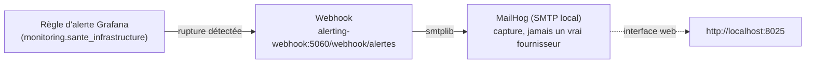

# Monitoring du data lake OMEGA LAKE

**Compétence couverte : C20 — Gérer le catalogue des données (volet monitoring), issue #80 (C20bis)**
**Épreuve associée : E7**

Le référentiel de compétences est explicite sur les deux derniers
critères d'évaluation de C20 (voir
[`Referentiel_Activites_Competences_Evaluation_DE.pdf`](../reference/Referentiel_Activites_Competences_Evaluation_DE.pdf),
page 24) :

> *Le monitorage permet le suivi des conditions matérielles et applicatives.*
> *Le monitorage génère une alerte lors d'une rupture de service.*

Un premier design (24/09/2026) ne couvrait que l'applicatif (fraîcheur/
volumétrie) sans le matériel, et ne prévoyait pas d'alerte réellement
déclenchée — corrigé après relecture du référentiel, voir §1 et §3
ci-dessous.

---

## 1. Ce qui est suivi

Trois relevés, en ajout seul (append-only) dans le schéma Postgres
`monitoring` (même base `datacore_omega_bi` que l'entrepôt OMEGA BI,
sobriété RGESN — pas de nouvelle base), pour tracer une évolution dans
le temps, pas seulement un dernier état :

| Table | Volet | Alimentée par |
|---|---|---|
| `monitoring.catalogue_lake` | **Applicatif** — volumétrie et fraîcheur par flux/zone | `datacore.storage.lake.monitoring.enregistrer_catalogue()`, réutilise `catalogue.construire_catalogue()` (C20) |
| `monitoring.purges_lake` | **Applicatif** — dernière purge RGPD exécutée par flux | `datacore.storage.lake.monitoring.enregistrer_purge()`, appelée depuis `purge.py::main()` (C21) |
| `monitoring.sante_infrastructure` | **Matériel** — MinIO accessible, capacité utilisée | `datacore.storage.lake.monitoring.verifier_sante_infrastructure()` |

Schéma créé par la migration Alembic `a487cd05b8d5` (même mécanisme que
`gouvernance`/`exploitation`, C14/C16). `bi_reader` a `SELECT` sur
`monitoring` (comme sur `exploitation`/`dimensions`/`commercial`) —
`gouvernance` reste exclu, ce choix n'est pas révisé ici (voir
`registre_rgpd_entrepot.md` §4).

Dashboard Grafana : « OMEGA LAKE — Monitoring (C20bis) »
(`infra/grafana/dashboards/monitoring_lake.json`), réutilise le
datasource `omega_bi_reader` déjà provisionné pour C16bis — même
principe de sobriété.

---

## 2. Vérifié en conditions réelles (25/09/2026)

```
$ python3 -m datacore.storage.lake.monitoring
catalogue : 15 entrée(s) enregistrée(s)
santé infrastructure : {'minio_accessible': True, 'capacite_utilisee_octets': 2050406}
```

Les 15 entrées correspondent aux 5 flux × 3 zones réellement présentes
dans le lake (voir `catalogue_omega_lake.md`). `bi_reader` confirmé
capable de lire `monitoring.*` (`SELECT` direct via `psql`), et refusé
sur `gouvernance.*` (`permission denied for schema gouvernance`) —
cohérent avec C16bis.

---

## 3. Alerte lors d'une rupture de service

**Choix du canal** (voir échange avec l'utilisateur, 25/09/2026) :
e-mail réel via `smtplib`, envoyé à un capteur SMTP **local** (MailHog,
`infra/docker/docker-compose.yml`) plutôt qu'un vrai fournisseur externe
(Gmail envisagé puis écarté — identifiant réel à gérer, et un e-mail
serait envoyé à chaque exécution automatisée des tests d'intégration).
MailHog expose une interface web (http://localhost:8025) pour visualiser
les e-mails reçus, et une API REST utilisée par les tests.

**Chaîne complète** :



- **Règle d'alerte** (`infra/grafana/provisioning/alerting/lake_monitoring.yaml`) :
  interroge le dernier relevé de `monitoring.sante_infrastructure`,
  déclenche si `minio_accessible = false`.
- **Point de contact** : webhook vers `alerting-webhook` (nouveau
  service Flask, `src/datacore/alerting/webhook.py`) — séparé
  d'`api-mock` (qui simule les sources de données externes d'Omega
  Logistics, sans rapport thématique avec l'observabilité interne).
- **Relais e-mail** : `envoyer_alerte()` construit et envoie un vrai
  e-mail via `smtplib.SMTP`, capté par MailHog.

### Test réel de bout en bout (25/09/2026)

Plutôt qu'une simulation sur papier — même exigence que le test
`kill -9` du consommateur SSE (C19,
[`integration_infrastructure_omega_lake.md` §3](integration_infrastructure_omega_lake.md)) :

1. `docker stop datacore-omega-lake` (coupure réelle de MinIO).
2. `verifier_sante_infrastructure()` relancé pour de vrai → enregistre
   `minio_accessible = false` dans Postgres.
3. Règle d'alerte Grafana évaluée (intervalle 30 s, `for: 30 s`) →
   passée à l'état `active` en ~30 s (vérifié via
   `/api/alertmanager/grafana/api/v2/alerts`).
4. E-mail réel reçu dans MailHog (~20 s après le passage à `active` —
   délai de groupement des notifications de Grafana, pas un délai
   anormal) :
   - Sujet : `[DATA CORE] Alerte Grafana (firing) : MinIO injoignable`
   - Corps : `MinIO est injoignable -- rupture de service détectée sur
     le dernier relevé de monitoring.sante_infrastructure.`
5. `docker start datacore-omega-lake`, nouveau relevé sain enregistré →
   l'alerte repasse à l'état résolu en ~15 s, confirmé par API.

Preuve d'une chaîne réellement fonctionnelle : détection → alerte →
notification → résolution, pas seulement une règle configurée et
jamais déclenchée.

**Ce que ce test ne couvre pas** : la fraîcheur des données
(`monitoring.catalogue_lake`) n'a pas encore de règle d'alerte dédiée
— une seule règle suffit à démontrer le critère du référentiel, une
seconde pourrait être ajoutée si le besoin s'en fait sentir (ex. aucune
nouvelle partition `raw/` déposée au-delà de la cadence attendue).

---

## 4. Références

- [`catalogue_omega_lake.md`](catalogue_omega_lake.md) — C20, catalogue par introspection.
- [`registre_rgpd_lake.md`](registre_rgpd_lake.md) — C21, procédure de purge alimentant `monitoring.purges_lake`.
- [`gestion_operationnelle_omega_bi.md`](gestion_operationnelle_omega_bi.md) §3.5 — Grafana pour C16bis, même datasource réutilisé ici.
- [`Referentiel_Activites_Competences_Evaluation_DE.pdf`](../reference/Referentiel_Activites_Competences_Evaluation_DE.pdf) page 24 — critères C20 exacts.
