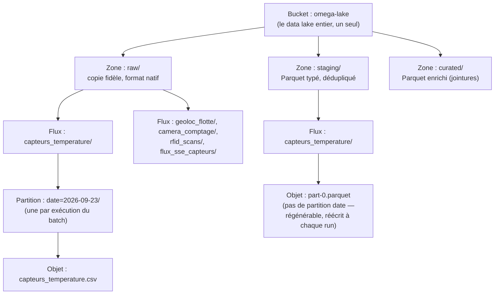

# Organisation du data lake OMEGA LAKE — vocabulaire et hiérarchie

Document d'orientation, pas une nouvelle compétence : les décisions et
leur justification vivent dans
[`architecture_omega_lake.md`](architecture_omega_lake.md) (C18),
[`integration_infrastructure_omega_lake.md`](integration_infrastructure_omega_lake.md) (C19)
et [`catalogue_omega_lake.md`](catalogue_omega_lake.md) (C20). Ce
document répond à une seule question : **qu'est-ce qui contient quoi**,
pour s'y retrouver dans un chemin comme
`s3://omega-lake/raw/capteurs_temperature/date=2026-09-23/capteurs_temperature.csv`
sans relire tout le reste.

---

## 1. Quatre niveaux, du plus large au plus précis

| Niveau | Ce que c'est | Exemple réel | Combien il y en a |
|---|---|---|---|
| **Bucket** | Le data lake tout entier — un conteneur de stockage objet unique | `omega-lake` | 1 seul, toujours |
| **Zone** | Une étape de transformation à l'intérieur du bucket — pas un bucket séparé, un simple préfixe de chemin | `raw`, `staging`, `curated` | 3, fixes |
| **Flux** | Une source de données IoT distincte, avec son propre schéma | `capteurs_temperature`, `geoloc_flotte`, `camera_comptage`, `rfid_scans`, `flux_sse_capteurs` | 5, fixes |
| **Partition / objet** | Un dépôt daté (`raw/`) ou le fichier consolidé courant (`staging/`/`curated/`) | `date=2026-09-23/capteurs_temperature.csv` ou `part-0.parquet` | variable dans le temps |

Un « bucket » n'est **pas** un dossier au sens système de fichiers — le
stockage objet (S3/MinIO) n'a pas de vrais dossiers, seulement des clés
plates qui *ressemblent* à des chemins (`raw/capteurs_temperature/...`).
Ce que la console MinIO affiche comme des dossiers cliquables n'est
qu'une reconstitution visuelle à partir des `/` dans les clés.



**Exception au tableau ci-dessus, volontaire** : un 4e préfixe,
`curated_bi/`, existe depuis C21bis — ce n'est **pas** une 4e zone du
pipeline (`raw/`→`staging/`→`curated/` reste la chaîne de
transformation à 3 étapes), mais un **export dérivé** de `curated/`,
réservé à l'utilisateur `lake_reader` (accès restreint à ce seul
préfixe), avec `vehicule_id` pseudonymisé pour les 2 flux de
géolocalisation. Voir
[`registre_rgpd_lake.md` §4bis](registre_rgpd_lake.md#4bis-export-pseudonymisé-curated_bi).

---

## 2. Anatomie d'un chemin réel

Le chemin qui pose question :

```
s3://omega-lake/raw/capteurs_temperature/date=2026-09-23/capteurs_temperature.csv
     └───┬────┘ └┬┘ └───────┬──────────┘ └──────┬───────┘ └──────────┬─────────┘
      bucket    zone       flux              partition              objet
```

Et la f-string qui le génère (`transform.py::motif_raw`) :

```python
f"s3://{bucket}/raw/{flux}/date=*/*.{extension}"
```

| Segment | Valeur ici | D'où ça vient |
|---|---|---|
| `s3://` | fixe | protocole/convention d'adressage (voir glossaire, `topographie_donnees.md`) |
| `{bucket}` | `omega-lake` | `OMEGA_LAKE_BUCKET` (config), toujours le même |
| `raw` | fixe dans cette fonction | cette f-string ne lit **que** la zone `raw/` — `_lecture_zone()` dans `catalogue.py` a une branche équivalente pour `staging`/`curated` |
| `{flux}` | ex. `capteurs_temperature` | paramètre de la fonction — un des 5 noms de flux (§3) |
| `date=*` | motif, pas une valeur | le `*` est un **joker glob** : il matche n'importe quelle date de partition réellement présente, pas une date précise |
| `*.{extension}` | motif, pas une valeur | idem : matche le nom de fichier réel quel qu'il soit, `{extension}` fixe juste `.csv`/`.json`/`.ndjson` selon le flux |

**Pourquoi des jokers (`*`) plutôt que des chemins exacts** : une
exécution de l'ingestion batch dépose une nouvelle partition `date=`
sans écraser les précédentes (§1 de `integration_infrastructure_omega_lake.md`).
Le nombre exact de partitions et leurs dates changent à chaque run — le
motif glob les lit **toutes en une seule requête** DuckDB
(`read_csv_auto('s3://.../date=*/*.csv')`), sans qu'aucun code n'ait
besoin de connaître les dates à l'avance.

---

## 3. Les 5 flux, en un coup d'œil

| Flux | Zone `raw/` (format) | Contenu |
|---|---|---|
| `capteurs_temperature` | CSV | Température par entrepôt/zone |
| `geoloc_flotte` | CSV | Position GPS par véhicule |
| `camera_comptage` | CSV | Comptage de passages |
| `rfid_scans` | JSON (liste) | Scans palette par SKU |
| `flux_sse_capteurs` | NDJSON (plusieurs fichiers par jour) | Température + géoloc, temps réel |

Détail complet (schéma, volumétrie, clés de jointure) :
[`architecture_omega_lake.md` §1](architecture_omega_lake.md#1-les-5-flux-à-absorber).

---

## 4. Références

- [`architecture_omega_lake.md`](architecture_omega_lake.md) — pourquoi
  ces 3 zones, ces 5 flux, ces formats (conception, C18).
- [`integration_infrastructure_omega_lake.md`](integration_infrastructure_omega_lake.md) —
  comment les objets sont réellement écrits/lus (C19).
- [`catalogue_omega_lake.md`](catalogue_omega_lake.md) — inventaire
  généré du contenu réel, instantané des chemins (C20).
- [`topographie_donnees.md`](topographie_donnees.md) §1 — glossaire
  métier général (Bucket, S3, `s3://`, Zone, Flux, etc.).
